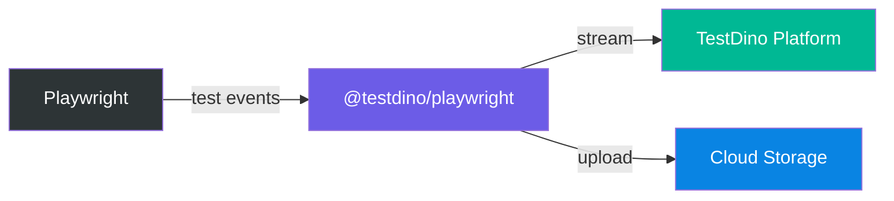

# @testdino/playwright

[](https://www.npmjs.com/package/@testdino/playwright)
[](https://nodejs.org/)

Real-time streaming reporter and CLI for Playwright that captures comprehensive test execution data and streams it to [TestDino](https://www.testdino.com) for advanced analytics and insights.

**[Website](https://www.testdino.com)** | **[Documentation](https://docs.testdino.com/)** | **[Get Your Token](https://docs.testdino.com/getting-started)**

## Features

- **Real-time Streaming** — test results streamed as they happen, not after the run completes
- **Automatic Failover** — seamless fallback to HTTP if the primary connection drops
- **Artifact Uploads** — screenshots, videos, and traces uploaded to cloud storage
- **Rich Metadata** — git, CI, system, and Playwright environment data collected automatically
- **Code Coverage** — Istanbul coverage extracted per-test, merged across shards
- **Shard Support** — group sharded CI runs into a single logical run
- **Graceful Degradation** — reporter errors never break your tests

## How It Works



The reporter hooks into Playwright's lifecycle, buffers events, and streams them to TestDino in real time. Artifacts (screenshots, videos, traces) are uploaded to cloud storage. If the streaming connection drops, events automatically fall back to HTTP delivery.

## Installation

```bash
npm install @testdino/playwright
```

**Requirements:** Node.js >= 18, @playwright/test >= 1.52.0

## Quick Start

### Using the CLI (Recommended)

```bash
# Set your token (get one at testdino.com)
export TESTDINO_TOKEN=your_token

# Run all tests
npx tdpw test

# Or pass token directly
npx tdpw test --token YOUR_TOKEN
```

Any option not recognized by TestDino is passed through to Playwright:

```bash
npx tdpw test --headed --project=chromium
npx tdpw test --retries=2 --workers=4
npx tdpw test --shard=1/3
npx tdpw test --coverage
npx tdpw test --debug
npx tdpw test --no-artifacts
```

### Using as a Playwright Reporter

```typescript
// playwright.config.ts
import { defineConfig } from '@playwright/test';

export default defineConfig({
  reporter: [['@testdino/playwright', { token: process.env.TESTDINO_TOKEN }], ['html']],
});
```

```bash
npx playwright test
```

## Configuration

### Options

| Option      | CLI Flag         | Environment Variable  | Description                     |
| ----------- | ---------------- | --------------------- | ------------------------------- |
| `token`     | `--token`, `-t`  | `TESTDINO_TOKEN`      | Authentication token (required) |
| `serverUrl` | `--server-url`   | `TESTDINO_SERVER_URL` | Server URL                      |
| `debug`     | `--debug`        | `TESTDINO_DEBUG`      | Enable debug logging            |
| `ciRunId`   | `--ci-run-id`    | -                     | Group sharded test runs         |
| `artifacts` | `--no-artifacts` | -                     | Disable artifact uploads        |
| `coverage`  | `--coverage`     | -                     | Enable code coverage collection |

### Config File

```typescript
// testdino.config.ts
export default {
  token: process.env.TESTDINO_TOKEN,
  debug: false,
  artifacts: true,
  coverage: {
    enabled: true,
    include: ['src/**'],
    exclude: ['**/node_modules/**'],
    thresholds: {
      lines: 80,
      branches: 60,
      functions: 80,
      statements: 80,
    },
  },
};
```

### Priority

1. CLI flags (`--token`)
2. Config file (`testdino.config.ts`)
3. Playwright config (reporter options)
4. Environment variables

## CI/CD Integration

### GitHub Actions

```yaml
name: E2E Tests
on: [push, pull_request]

jobs:
  test:
    runs-on: ubuntu-latest
    steps:
      - uses: actions/checkout@v4
      - uses: actions/setup-node@v4
        with:
          node-version: '20'
      - run: npm ci
      - run: npx playwright install --with-deps
      - name: Run tests
        env:
          TESTDINO_TOKEN: ${{ secrets.TESTDINO_TOKEN }}
        run: npx tdpw test
```

### Sharded Execution

```yaml
jobs:
  test:
    strategy:
      fail-fast: false
      matrix:
        shard: [1, 2, 3, 4]
    steps:
      - name: Run shard
        env:
          TESTDINO_TOKEN: ${{ secrets.TESTDINO_TOKEN }}
        run: npx tdpw test --ci-run-id ${{ github.run_id }} -- --shard=${{ matrix.shard }}/4
```

All shards with the same `--ci-run-id` are grouped into a single logical run on the TestDino dashboard.

### GitLab CI

```yaml
e2e-tests:
  image: mcr.microsoft.com/playwright:v1.52.0-jammy
  script:
    - npm ci
    - npx tdpw test
  variables:
    TESTDINO_TOKEN: $TESTDINO_TOKEN
```

## Code Coverage

**1.** Instrument your application with Istanbul (e.g., `babel-plugin-istanbul`). Your app must expose `window.__coverage__` in the browser.

**2.** Use the TestDino fixture in your tests:

```typescript
import { test, expect } from '@testdino/playwright';

test('my test', async ({ page }) => {
  await page.goto('/');
  // Coverage is collected automatically after each test
});
```

**3.** Enable coverage:

```bash
npx tdpw test --coverage
```

Coverage works with sharded execution — TestDino merges coverage data across shards automatically.

## Troubleshooting

| Issue                                                | Solution                                                  |
| ---------------------------------------------------- | --------------------------------------------------------- |
| `Token is required but not provided`                 | Set token via `--token`, `TESTDINO_TOKEN`, or config file |
| `TestDino Execution Limit Reached`                   | Tests still run. Upgrade plan or wait for quota reset     |
| `Kafka delivery failed — switching to HTTP fallback` | Normal. Automatic failover. Tests are never affected      |

Enable debug logging for detailed diagnostics:

```bash
npx tdpw test --debug
```

## FAQ

**Q: Can I use TestDino with other Playwright reporters?**
Yes. TestDino works alongside HTML, JUnit, JSON, or any other reporter.

**Q: What happens if TestDino is unavailable?**
Tests run normally. Only event streaming is affected.

**Q: Does this work with Playwright VSCode extension?**
Yes. Configure TestDino in `playwright.config.ts`.

## Support

- [Documentation](https://docs.testdino.com/)
- [Getting Started](https://docs.testdino.com/getting-started)
- [Email Support](mailto:support@testdino.com)

---

Copyright 2025 TestDino. All rights reserved.
